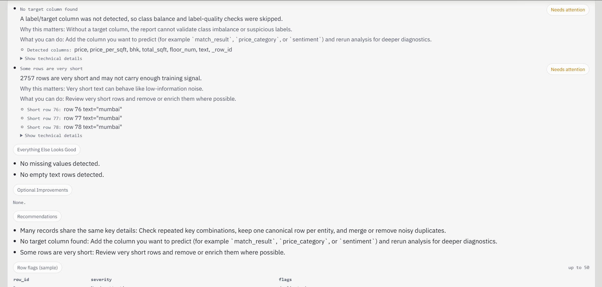
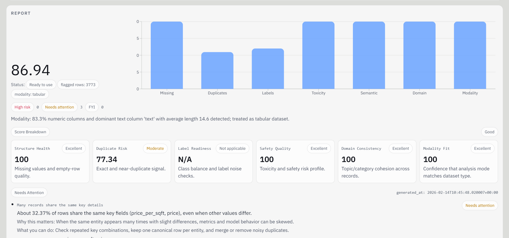

<!-- # Dataset Quality Analyzer (Hugging Face Powered)

Tooling to inspect a dataset before training by flagging duplicates, label issues, toxicity, domain mixing, and leakage, then producing a quality score (0-100) and JSON report.

## Quickstart

### 1) Python env

```bash
python -m venv .venv
.venv\Scripts\activate
pip install -r requirements.txt
```

### 2) Run backend (FastAPI)

```bash
uvicorn api.main:app --reload --port 8000
```

### 3) Run frontend

```bash
cd frontend
npm install
npm run dev
```

Set `NEXT_PUBLIC_API_URL` in `frontend/.env.local` if your API is not `http://localhost:8000`.

## CLI (local report)

```bash
python -m reports.report_generator --csv data/sample.csv --out reports/sample.report.json
```

Fast mode without downloading HF models:

```bash
python -m reports.report_generator --csv data/sample.csv --out reports/sample.report.json --no-hf-models
```

## What changed in this refactor

- Modality-aware routing (`text`, `tabular`, `mixed`) now runs only relevant analyzers.
- Tabular datasets use key-based duplicate logic instead of semantic embedding duplicates.
- Domain-mixing logic is split by modality:
  - text: embedding clustering
  - tabular: cluster/category entropy alignment
- Label outlier detection now uses class-distance Z-scores.
- Embeddings are cached on disk (`embeddings/cache`) using dataset signature keys.
- Issue output includes plain explanation, why-it-matters, and concrete row examples.
 -->


# 🧪 Dataset Quality Analyzer (Hugging Face Powered)

A modality-aware dataset auditing engine that evaluates machine learning datasets **before training**.

Instead of debugging models after failure, this tool identifies data-related risks early and produces a structured quality report with a dataset health score (0–100).

---

# 🎯 What This Project Does

The analyzer automatically detects:

- 🔁 Exact duplicates
- 🔑 Key-based (business key) duplicates
- 🧠 Semantic near-duplicates (using embeddings for text datasets)
- ❌ Missing values and empty rows
- ⚖ Label imbalance & missing label column
- ☠ Toxic or unsafe content
- 🔓 Train–test leakage
- 🧩 Domain mixing inconsistencies

It generates:

- 📊 Dataset Health Score (0–100)
- 🏷 Verdict (Production Ready / Needs Cleanup / High Risk)
- 📋 Plain-language issue explanations
- 📄 Structured JSON report
- 📑 Row-level flags

> Think of it as ESLint for ML datasets.

---

# 🏗 Architecture Overview

The system has three main layers:

## 1️⃣ Frontend (Next.js + TypeScript)
- Upload CSV or use Hugging Face dataset
- View health score and verdict
- See grouped issues ("Needs Attention", "Optional Improvements")
- View row-level flags
- Score breakdown visualization

## 2️⃣ Backend (FastAPI)
- `/analyze/csv`
- `/analyze/hf`
- `/health`
- Routes datasets into analyzer modules
- Returns structured JSON report

## 3️⃣ Analyzer / ML Layer

### Step 1: Modality Detection
Classifies dataset as:
- `tabular`
- `text`
- `mixed`

### Step 2: Conditional Analysis

If **Tabular Dataset**:
- Exact duplicate detection
- Business-key duplicate detection
- Category entropy checks
- Structural validation

If **Text Dataset**:
- Embedding-based semantic duplicates (`all-MiniLM-L6-v2`)
- Toxicity detection (`unitary/toxic-bert`)
- Label imbalance detection
- Centroid-based outlier detection (Z-score)

### Step 3: Scoring Engine
Each module contributes to weighted subscores → produces final Dataset Health Score.

---

# 🖼 Example Output

## Health Score Dashboard


## Needs Attention Section


## Breakdown + Row Flags


---

# ⚙️ Full Setup Instructions

## 1️⃣ Clone Repository

```bash
git clone https://github.com/your-username/dataset-quality-analyzer.git
cd dataset-quality-analyzer
